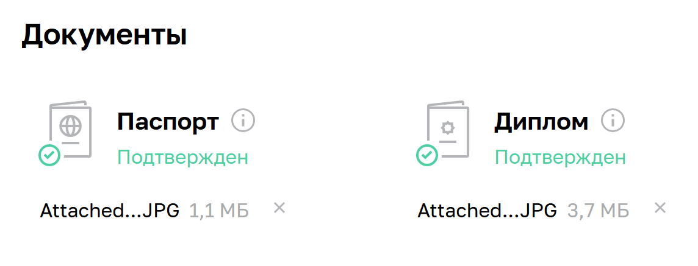

# Допуск к дипломной работе - Илларионов Дмитрий

1. Получилось ли у вас загрузить в личный кабинет документы, подтверждающие личность, и диплом о высшем или среднем специальном образовании?

- Да

Но, загрузил кажетя только последний диплом - Иженера, до этого еще есть диплом "бакалавр". Его кажется не загружал.

Пришлите ссылку на скриншот личного кабинета.

2. Нужна ли вам справка об обучении после сдачи дипломной работы? Справка выдаётся всем студентам, в том числе тем, у кого нет диплома о высшем или среднем специальном образовании.
- Да

3. Выполнен ли вами необходимый минимум заданий на каждом модуле профессии для допуска к дипломной работе?
- Да, но, последнее ДЗ на проверке сейчас, надеюсь его примут.

